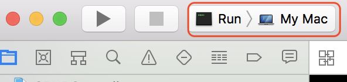

## Vapor 3 Series I - CRUD with Controllers
As an iOS developer, I am super excited that Apple made Swift open-sourced in 2015.
Not only does it mean there will be more interesting features, but we are able to run Swift on Linux machines as well.
More importantly, the later one brings us the possibility to write a server with Swift.
Currently, there are couple of different server side Swift frameworks, such as Vapor, Perfect, and Kitura.
The reason why I choose Vapor 3 in this article is that it supports [SwiftNIO](https://github.com/apple/swift-nio) quickly.
As a result, Vapor 3 provides succinct asynchronous APIs and it's a very good chance to practice asynchronous programming.
For the purpose of this article, I am going to demonstrate how to build RESTful endpoints with Vapor 3.

### Preparation
If you haven't installed Vapor yet, please follow [this instruction](https://docs.vapor.codes/3.0/install/macos/) to install Vapor properly.
After installation succeeds, we can generate our new project folder with [Vapor's toolbox new](https://docs.vapor.codes/3.0/getting-started/toolbox/#new) command.
```
vapor new CRUDControllers
```
Since we don't need the model and controller templates created by the toolbox, please delete everything inside the `Models` and `Controllers` folders with the following commands.
```
cd CRUDControllers
rm -rf Sources/App/Models/
rm -rf Sources/App/Controllers/
```
Besides, we should remove the useless code before trying to build the project.
First of all, open `Sources/App/configure.swift` file, and remove the following line.
```
migrations.add(model: Todo.self, database: .sqlite)
```
Secondly, go to `Sources/App/router.swift` file, and remove the following lines.
```
// Example of configuring a controller		
let todoController = TodoController()		
router.get("todos", use: todoController.index)		
router.post("todos", use: todoController.create)		
router.delete("todos", Todo.parameter, use: todoController.delete)
```
Finally, we can generate the Xcode project file with `vapor xcode -y`, and this command will open `CRUDControllers.xcodeproj` automatically. We can select `Run` scheme and the project should be built successfully.


Before creating our model type, there is still one important thing needs mentioning inside `configure.swift`.
Throughout this article, we are going to use an in-memory SQLite database, so we can keep the default provider `FluentSQLiteProvider` and the database configurations generated by the toolbox.

### Model
It's best practice to create files outside of Xcode.
This lets Swift Package Manager, which is used by Vapor's toolbox, ensure that the files link to the correct target.
Let's create our `User` model file and regenerate the Xcode project file with the following commends.
```
mkdir Sources/App/Models
touch Sources/App/Models/User.swift
vapor xcode -y
```

Our `User` model will have three properties for now, which are `id`, `name`, and `username`.
Furthermore, as I mentioned before, our `User` model will be stored in a SQLite database.
Therefore, open the `User.swift` with Xcode, and write the following lines into the file.
```
import Vapor
import FluentSQLite

final class User: Codable {
    var id: Int?
    var name: String
    var username: String

    init(name: String, username: String) {
        self.name = name
        self.username = username
    }
}

extension User: SQLiteModel {}
extension User: Migration {}
```
The reason why our `User` model conforms `Migration` protocol is that this protocol is used to create a table for the model in the database.
Moreover, the table should be created when the application starts.
Let's switch to `configure.swift`, and add the following line before `services.register(migrations)`.
```
migrations.add(model: User.self, database: .sqlite)
```
Migrations should only run once.
If they have run in a database, they will never be executed again.
However, since we are using an in-memory database right now, the migration will be executed every time the application starts.

Considering that our CRUD endpoints should be able to receive JSON data as the HTTP body and return the responses with the JSON format, Vapor provides `Content` protocol, which allows us to convert the model to the JSON format.
Since our `User` model has already conformed `Codable` protocol, all we have to do is appending the following line at the bottom of `User.swift`.
```
extension User: Content {}
```

Finally, in order to retrieve `User` model more easily with our endpoints, please add the following line below the `extension User: Content {}`
```
extension User: Parameter {}
```

At this point, we finish our `User` model. Please try to build and run the application, in order to make sure everything works fine.

### Controller
It's time to create our controller now.
Again, Let's switch back to Terminal and create our controller file with the following commands.
```
mkdir Sources/App/Controllers
touch Sources/App/Controllers/UsersController.swift
vapor xcode -y
```

Let's implement our CRUD functionalities one by one.
First of all, our `UsersController` should be able to create our `User` model.
Please write the following lines into our `UsersController.swift` file.
```
import Vapor

final class UsersController {
    func createHandler(_ req: Request) throws -> Future<User> {
        return try req.content.decode(User.self).flatMap { (user) in
            return user.save(on: req)
        }
    }
}
```
Since our `User` model already conforms `Content` protocol, a `User` instance can be generated from the JSON data of the HTTP body with `req.content.decode(User.self)`.
In addition, since the model also conforms `SQLiteModel` protocol, the instance can be saved into the SQLite database with `user.save(on: req)`.
We hook these two operations with `flatMap`, because both of them are asynchronous.
Here is the first time we encounter `Future` type.
As I mention at the beginning of this article, Vapor 3 provides asynchronous APIs because it supports SwiftNIO.
If you are not familiar with `Future` type yet, please read [this document](https://docs.vapor.codes/3.0/getting-started/async/) for more details.

Secondly, our `UsersController` should be able to retrieve our `User` model.
Please append the following lines below `createHandler` method we just wrote.
```
final class UsersController {
    // ...

    func getAllHandler(_ req: Request) throws -> Future<[User]> {
        return User.query(on: req).decode(User.self).all()
    }

    func getOneHandler(_ req: Request) throws -> Future<User> {
        return try req.parameters.next(User.self)
    }
}
```
On one hand, we retrieve all instances of our `User` model with querying the database.
On the other hand, since our `User` model conforms `Parameter` protocol, `req.parameters.next(User.self)` will fetch the instance with the given identifier.

Next step is implementing the updating functionality for our `UsersController`.
Let's add the following method below the retrieving methods.
```
final class UsersController {
    // ...

    func updateHandler(_ req: Request) throws -> Future<User> {
        return try flatMap(to: User.self, req.parameters.next(User.self), req.content.decode(User.self)) { (user, updatedUser) in
            user.name = updatedUser.name
            user.username = updatedUser.username
            return user.save(on: req)
        }
    }
}
```
The `flatMap` function we use here is different from the previous one.
It actually waits both of `req.parameters.next(User.self)` and `req.content.decode(User.self)` finish, and then executes the block.
Within the block, we just update the instance and save it into the database.

Then, let's add the final piece of our CRUD endpoints, which is the deletion functionality.
As usual, please append the following method below `updateHandler` method.
```
final class UsersController {
    // ...

    func deleteHandler(_ req: Request) throws -> Future<HTTPStatus> {
        return try req.parameters.next(User.self).flatMap { (user) in
            return user.delete(on: req).transform(to: HTTPStatus.noContent)
        }
    }
}
```
We retrieve the instance with `req.parameters.next(User.self)` and delete it from the database with `user.delete(on: req)`.
Since we don't have to return any JSON format, we can just return a no-content HTTP status code with `transform(to: HTTPStatus.noContent)`, which will convert `Future<User>` to `Future<HTTPStatus>`.

Last but not least, we have to hook our `UsersController` with the router.
There are two necessary things to make everything work.
First, our `UsersController` should conform `RouteCollection` protocol and implement the `func boot(router: Router) throws` method as the following.
```
final class UsersController: RouteCollection {
    // ...

    func boot(router: Router) throws {
        let usersRoute = router.grouped("api", "users")
        usersRoute.get(use: getAllHandler)
        usersRoute.get(User.parameter, use: getOneHandler)
        usersRoute.post(use: createHandler)
        usersRoute.put(User.parameter, use: updateHandler)
        usersRoute.delete(User.parameter, use: deleteHandler)
    }
}
```
Inside this method, we tell the router which path, HTTP method and handler should be used for each endpoint.
Secondly, please switch to `Sources/App/routes.swift` and write the following lines, in order to register our `UsersController` with the router.
```
public func routes(_ router: Router) throws {
    let usersController = UsersController()
    try router.register(collection: usersController)
}
```
