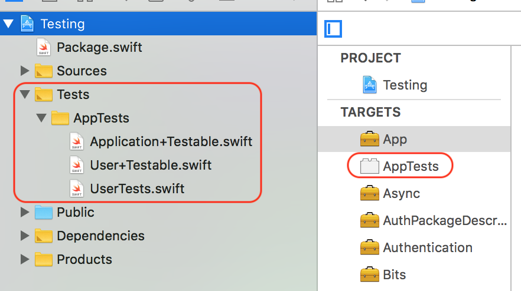
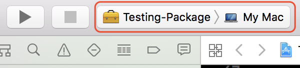
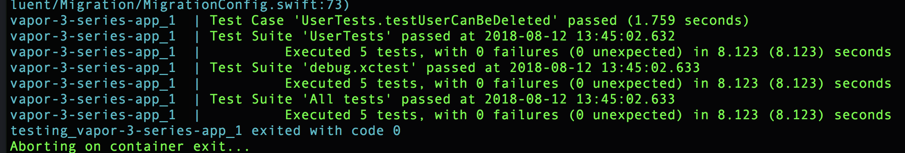

## Vapor 3 Series III - Testing
In [our previous article](https://medium.com/swift2go/vapor-3-series-ii-authentication-ff17847a9659), we implemented two ways to authenticate users: HTTP basic authentication and bearer token authorization.
As a result, our application only accepts requests from authenticated users.
However, we should write some unit tests for our endpoints, even though our application is quite simple.
Testing is an important part of software development, and writing unit tests allows us to develop and evolve our application quickly.
In order to develop new feature quickly, we want to ensure that the existing features don't break, and having a thorough test suite lets us verify everything still works as we change our codebase.
In this article, I am going to demonstrate how to write unit tests for our CRUD endpoints and how to run the tests on Linux machine with Docker.

Please notice that this article will base on [the previous implementation](../Authentication).

### Preparation
One benefit to write our application in Swift is that we are able to run tests with the lovely Xcode.
However, in order to run tests with Xcode, we have to generate the test target beforehand.
Please open `Package.swift` and replace the line `.target(name: "Run", dependencies: ["App"])` with the following lines.
```
.target(name: "Run", dependencies: ["App"]),
.testTarget(name: "AppTests", dependencies: ["App"])
```
This tells Swift package manager, which is used by Vapor's toolbox, to generate `AppTests` target for our Xcode project.
Moreover, create `AppTests` folder and corresponding files with the following commands in Terminal as usual.
```
mkdir Tests/AppTests
touch Tests/AppTests/Application+Testable.swift
touch Tests/AppTests/User+Testable.swift
touch Tests/AppTests/UserTests.swift
```
In order to make our tests concise, we are going to write some helper methods of `Application` as well as our `User` model, so we create `Application+Testable.swift` and `User+Testable.swift` respectively.
Besides, the unit tests for our endpoints will be located in `UserTests.swift`.
Then, regenerate the Xcode project file with `vapor xcode -y` command.
Finally, please open the project with Xcode to verify that the test target appears and the project structure looks like the image below.


Let's start with writing the helper methods of `Application`.
Please open `Application+Testable.swift` and add the following code.
```
@testable import App
import Vapor
import FluentSQLite
import Authentication

extension Application {
    static func testable() throws -> Application {
        var config = Config.default()
        var services = Services.default()
        var env = Environment.testing
        try App.configure(&config, &env, &services)
        let app = try Application(config: config, environment: env, services: services)
        try App.boot(app)

        return app
    }
}
```
Here, we import the necessary dependencies and create `testable` method which allows us to create a testable instance of `Application`.
Again, within `Application+Testable.swift`, append the following lines.
```
extension Application {
    // ..

    func sendRequest<Body>(to path: String, method: HTTPMethod, headers: HTTPHeaders = .init(), body: Body?, isLoggedInRequest: Bool = false) throws -> Response where Body: Content {
        var headers = headers
        if isLoggedInRequest {
            let credentials = BasicAuthorization(username: "admin", password: "password")
            var tokenHeaders = HTTPHeaders()
            tokenHeaders.basicAuthorization = credentials
            let tokenBody: EmptyBody? = nil
            let tokenResponse = try sendRequest(to: "api/users/login", method: .POST, headers: tokenHeaders, body: tokenBody)
            let token = try tokenResponse.content.decode(Token.self).wait()
            headers.add(name: .authorization, value: "Bearer \(token.token)")
        }

        let httpRequest = HTTPRequest(method: method, url: URL(string: path)!, headers: headers)
        let wrappedRequest = Request(http: httpRequest, using: self)
        if let body = body {
            try wrappedRequest.content.encode(body)
        }
        let responder = try make(Responder.self)

        return try responder.respond(to: wrappedRequest).wait()
    }
}

struct EmptyBody: Content {}
```
We create `sendRequest` method which sends a request to a path and returns a `Reponse`.
If the request requires authentication, the admin user is used to log in and obtain the token.
Furthermore, `EmptyBody` type is used when there's no body to send in a request, because we cannot use `nil` for a generic type directly.

Next, open `User+Testable.swift` and add the following lines.
```
@testable import App
import FluentSQLite
import Crypto

extension User {
    static func create(name: String, username: String, on conn: SQLiteConnection) throws -> User {
        let password = try BCrypt.hash("password")
        let user = User(name: name, username: username, password: password)
        return try user.save(on: conn).wait()
    }
}
```
For our `User` model, not only do we import the necessary dependencies, but write a helper method to create a `User` instance and save it into the database as well.

### Test Endpoints
After finishing our helper methods of `Application` and `User` model, we can focus on writing unit tests for our endpoints.
First of all, open `UserTests.swift` and add the following code.
```
@testable import App
import Vapor
import FluentSQLite
import XCTest

final class UserTests: XCTestCase {
    let usersName = "Test"
    let usersUsername = "test1234"
    let usersURI = "/api/users/"
    var app: Application!
    var conn: SQLiteConnection!

    override func setUp() {
        super.setUp()

        app = try! Application.testable()
        conn = try! app.newConnection(to: .sqlite).wait()
    }

    override func tearDown() {
        super.tearDown()

        conn.close()
    }
 }
```
This generates an instance of `Application` for testing and creates a connection to the database before each test begins.
In addition, it also closes the connection after each test ends.

Secondly, please append the following function at the bottom of `UserTests` class.
```
final class UserTests: XCTestCase {
    // ...

    func testUserCanBeSaved() throws {
        let user = User(name: usersName, username: usersUsername, password: "password")
        let createUserResponse = try app.sendRequest(to: usersURI, method: .POST, body: user, isLoggedInRequest: true)
        let receivedUser = try createUserResponse.content.decode(User.Public.self).wait()

        XCTAssertEqual(receivedUser.name, usersName)
        XCTAssertEqual(receivedUser.username, usersUsername)
        XCTAssertNotNil(receivedUser.id)

        let body: EmptyBody? = nil
        let getUsersResponse = try app.sendRequest(to: usersURI, method: .GET, body: body, isLoggedInRequest: true)
        let receivedUsers = try getUsersResponse.content.decode([User.Public].self).wait()

        XCTAssertEqual(receivedUsers.count, 2)
        XCTAssertEqual(receivedUsers[1].name, usersName)
        XCTAssertEqual(receivedUsers[1].username, usersUsername)
        XCTAssertEqual(receivedUsers[1].id, receivedUser.id)
    }
 }
```
This function saves a new instance of our `User` model into the database via the endpoint `POST /api/users/`, and verifies the result with assertions.
Furthermore, it fetch all of the `User` instances via the endpoint `GET /api/users` and verifies the result as well.
Before running this test case, it's necessary to switch to `Testing-Package` scheme as the following image.



Now, we are able to run the test case and it should pass!

Then, we can write the test cases for the endpoints used for retrieving our `User` model.
Inside `UserTests.swift`, append the following functions below `testUserCanBeSaved` function.
```
func testSingleUserCanBeRetrieved() throws {
    let user = try User.create(name: usersName, username: usersUsername, on: conn)
    let body: EmptyBody? = nil
    let response = try app.sendRequest(to: "\(usersURI)/\(user.id!)", method: .GET, body: body, isLoggedInRequest: true)
    let receivedUser = try response.content.decode(User.Public.self).wait()

    XCTAssertEqual(receivedUser.name, usersName)
    XCTAssertEqual(receivedUser.username, usersUsername)
    XCTAssertEqual(receivedUser.id, user.id)
}

func testAllUsersCanBeRetrieved() throws {
    let user = try User.create(name: usersName, username: usersUsername, on: conn)
    let body: EmptyBody? = nil
    let response = try app.sendRequest(to: usersURI, method: .GET, body: body, isLoggedInRequest: true)
    let receivedUsers = try response.content.decode([User.Public].self).wait()

    XCTAssertEqual(receivedUsers.count, 2)
    XCTAssertEqual(receivedUsers[1].name, usersName)
    XCTAssertEqual(receivedUsers[1].username, usersUsername)
    XCTAssertEqual(receivedUsers[1].id, user.id)
}
```
Basically, what these two test cases do is saving an instance of our `User` model into the database, and then trying to retrieve the instance via our endpoints `GET /api/users/:id` and `GET /api/users` respectively.

Finally, let's add tests for the remaining endpoints `PUT /api/users/:id` and `DELETE /api/users/:id`.
Please append the following functions under `testAllUsersCanBeRetrieved` function.
```
func testUserCanBeUpdated() throws {
    let user = try User.create(name: "Vapor", username: "vapor1234", on: conn)
    let body = ["name": usersName, "username": usersUsername, "password": "password"]
    let response = try app.sendRequest(to: "\(usersURI)/\(user.id!)", method: .PUT, body: body, isLoggedInRequest: true)
    let receivedUser = try response.content.decode(User.Public.self).wait()

    XCTAssertEqual(receivedUser.name, usersName)
    XCTAssertEqual(receivedUser.username, usersUsername)
    XCTAssertEqual(receivedUser.id, user.id)
}

func testUserCanBeDeleted() throws {
    let user = try User.create(name: usersName, username: usersUsername, on: conn)
    let body: EmptyBody? = nil
    let _ = try app.sendRequest(to: "\(usersURI)/\(user.id!)", method: .DELETE, body: body, isLoggedInRequest: true)

    let response = try app.sendRequest(to: usersURI, method: .GET, body: body, isLoggedInRequest: true)
    let receivedUsers = try response.content.decode([User.Public].self).wait()

    XCTAssertEqual(receivedUsers.count, 1)
}
```
Similarly, we save an instance of our `User` model into the database, and then try to update and delete the instance via endpoints respectively.
At this point, we cover all of our endpoints with unit tests, and we can run the test with Xcode to verify everything works fine.

### Run Tests on Linux
When we deploy our application to a cloud service, we are deploying to an operating system different from the one used for development.
Therefore, it's important that we test our application on the same environment that we are going to deploy it on, which is likely a Linux environment.
However, Foundation on Linux isn't the same as Foundation on macOS, because Linux uses the pure Swift Foundation but macOS uses Objective-C counterpart instead.
Running tests on Linux requires us to do things differently from running them on macOS, since there is no Objective-C runtime which determines the test methods provided by our `XCTestCase`.
On Linux, we can declare test cases in `LinuxMain.swift` in the `Tests` folder, and this file is NOT part of our Xcode project.
Open `LinuxMain.swift` with any text editor and add the following lines.
```
import XCTest
@testable import AppTests

XCTMain([
  testCase(UserTests.allTests)
])
```
These lines provide an array for each `XCTestCase`, and `allTests` property contains a list of tuples consisting of the name of the test case.
Switch back to `UserTests.swift`, and append `allTests` property below `testUserCanBeDeleted` function.
```
static let allTests = [
    ("testUserCanBeSaved", testUserCanBeSaved),
    ("testSingleUserCanBeRetrieved", testSingleUserCanBeRetrieved),
    ("testAllUsersCanBeRetrieved", testAllUsersCanBeRetrieved),
    ("testUserCanBeUpdated", testUserCanBeUpdated),
    ("testUserCanBeDeleted", testUserCanBeDeleted)
]
```
When we run tests on Linux, the test executable uses this array to determine which tests to run.

As an iOS developer, neither do I possess any Linux machine, nor want to run test on any cloud service at this stage.
It turns out we are able to use [Docker](https://www.docker.com/) to run our tests in a Linux environment.
Please follow [this instruction](https://docs.docker.com/docker-for-mac/install/) to install Docker on your macOS.
After installation, open Terminal to create a new file called `Dockerfile` in the project directory with command `touch Dockerfile`, and add the following lines into the file.
```
FROM swift:4.1

WORKDIR /package

COPY . ./

RUN swift package resolve
RUN swift package clean

CMD ["swift", "test"]
```
Basically, we declare the demand of Swift 4.1 image, the working directory, where the content is, fetching dependencies, and default command to run tests.

Although there is no external database or services used in our application, it's still convenient to test our application with [Docker Compose](https://docs.docker.com/compose/).
Again, open Terminal to create a new file called `docker-compose.yml` in the project directory, and add the following lines into the file.
```
version: '3'

services:
  vapor-3-series-app:
    build: .
```
Here, we specify the version of Docker Compose, and define a service for our application.
The last step is typing the following commands in Terminal to run the tests.
```
docker-compose build
docker-compose up --abort-on-container-exit
```
When the tests finish running, we will see the output in Terminal like the following image.



### Conclusion
[Here](https://github.com/ShengHuaWu/Vapor3Series/tree/master/Testing) is the entire project.
